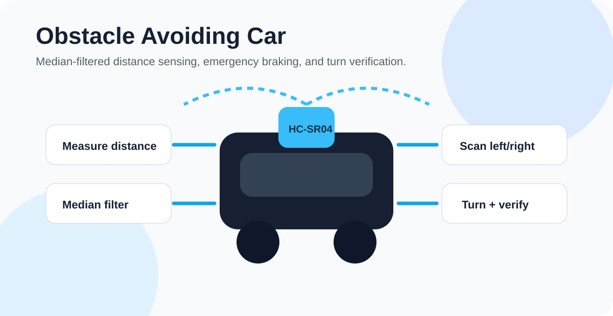

# Obstacle Avoiding Car

Arduino code for a small obstacle-avoiding robot car. The robot uses an HC-SR04 ultrasonic sensor mounted on a servo, median-filtered distance readings, emergency braking, directional scanning, and turn verification to avoid obstacles more reliably.



## Project Snapshot

| Area | Detail |
| --- | --- |
| Experience | Arduino autonomous robot car sketch |
| Core system | Ultrasonic sensing, median filtering, servo scan, motor control, turn verification |
| Design signal | Pin map, safety thresholds, and readable decision loop |
| Quality signal | Hardware setup notes, calibration guidance, future improvement roadmap |

## What It Does

- Measures distance with an HC-SR04 ultrasonic sensor.
- Uses a median filter to reduce bad readings and echo spikes.
- Requires at least two successful pings and treats sensor timeouts as a stop condition instead of open space.
- Stops and reverses if an obstacle is critically close.
- Scans left and right using a servo-mounted sensor.
- Chooses the clearer direction.
- Turns, re-centers the sensor, and verifies that the path is actually clear.
- Controls two DC motors through an L298N-style motor driver.

## Hardware

- Arduino Uno or compatible board
- HC-SR04 ultrasonic sensor
- Servo motor
- L298N motor driver
- Two DC motors
- Robot car chassis
- External battery supply for motors

## Pin Map

| Component | Arduino Pin |
|---|---|
| HC-SR04 trigger | `10` |
| HC-SR04 echo | `9` |
| Servo signal | `7` |
| Motor IN1 | `2` |
| Motor IN2 | `3` |
| Motor IN3 | `4` |
| Motor IN4 | `5` |
| Motor ENA | `6` |
| Motor ENB | `11` |

## Core Logic

```text
Read front distance
  -> emergency stop if too close
  -> move forward if clear
  -> reverse if blocked
  -> scan left and right
  -> turn toward better path
  -> verify front is clear
```

## Safety Thresholds

```cpp
#define SAFE_DISTANCE 35
#define CRITICAL_DISTANCE 15
#define TURN_SPEED 75
#define NUM_READINGS 3
```

Tune these values for your chassis, motor speed, battery voltage, and sensor placement.

## Quick Start

1. Install the Arduino IDE.
2. Install or enable the built-in `Servo` library.
3. Open `obstacle_avoiding_car.ino`.
4. Wire the robot according to the pin map.
5. Upload the sketch.
6. Open Serial Monitor at `9600` baud for distance and decision logs.

## Why Median Filtering Matters

Ultrasonic sensors can occasionally return noisy spikes. This project takes multiple readings, sorts them, and uses the median value. That makes the robot less likely to react to a single bad measurement.

If most pings time out, the sketch now fails closed: it stops the motors and waits for a fresh valid measurement. When exactly two pings succeed, the nearer reading is used so a single far echo cannot hide a nearby obstacle. A missing echo must never be interpreted as a clear path.

## Repository Structure

```text
Obstacle-Avoiding-Car/
  obstacle_avoiding_car.ino
  README.md
  docs/
    readme-preview.svg
```

## Future Improvements

- Add encoder feedback for more accurate turns.
- Add PID speed balancing between left and right motors.
- Add a battery voltage monitor.
- Add a wiring diagram photo.
- Add chassis calibration notes.
- Add autonomous maze-solving behavior.

## Safety Notes

Use a separate motor power supply and common ground with the Arduino. Keep wheels lifted during first upload/testing so unexpected motor movement does not damage the robot or nearby objects.

## Operator Experience

The serial console exposes `READY`, `SENSOR`, `ACTION`, `VERIFY`, and `SAFETY` states instead of ambiguous raw messages. The [operator experience guide](docs/USER_EXPERIENCE.md) defines the setup journey, recovery model, and presentation rules for future hardware revisions.

