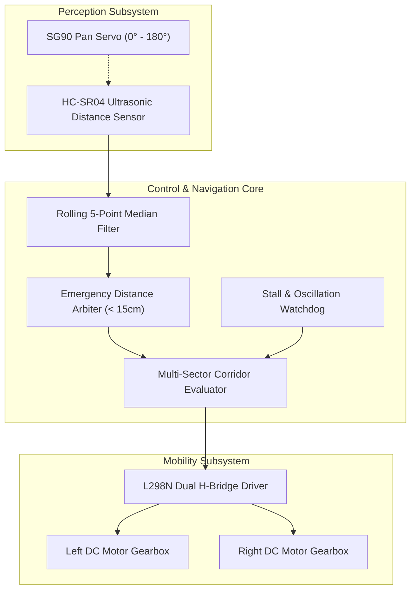
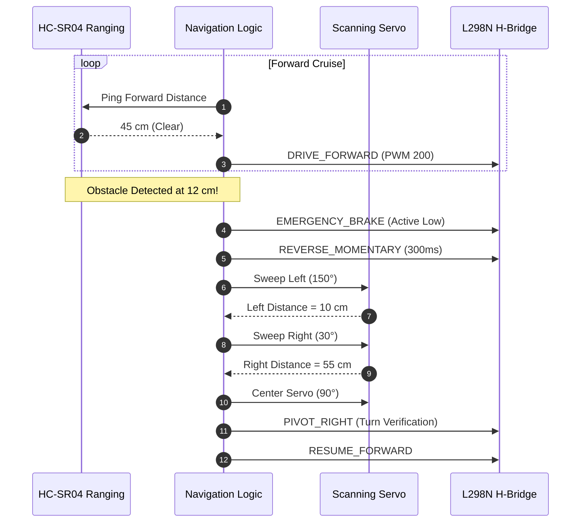
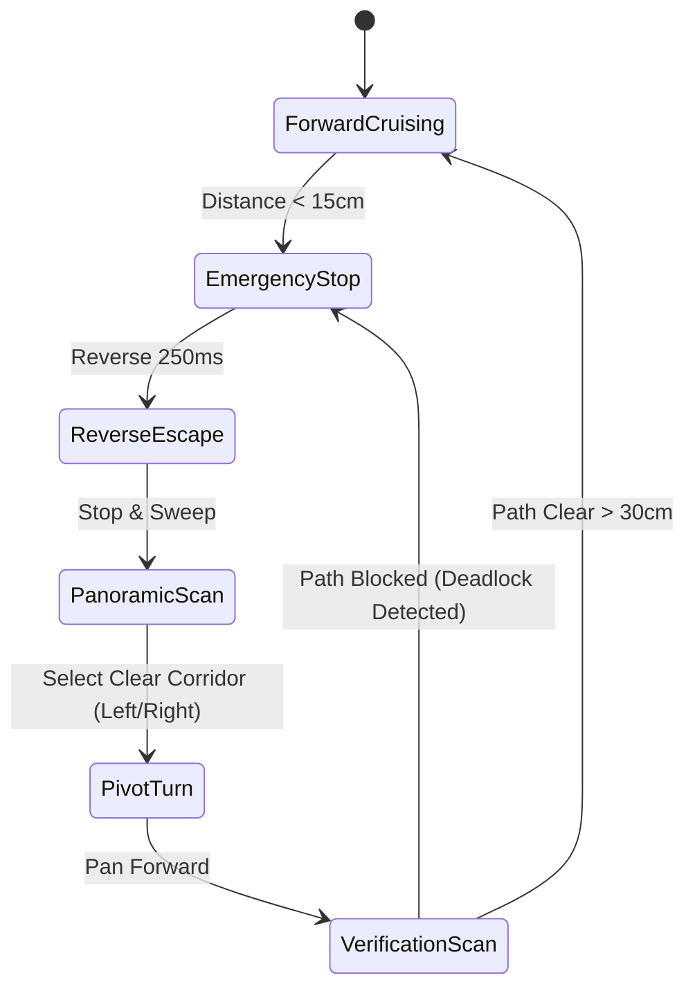

# Obstacle-Avoiding Robot Car: System Architecture

An autonomous robotic vehicle featuring median-filtered ultrasonic ranging, dynamic servo field-of-view scanning, and differential dual-motor steering.

## 1. System Topology

## 2. Obstacle Evasion Sequence

## 3. Navigation State Machine

